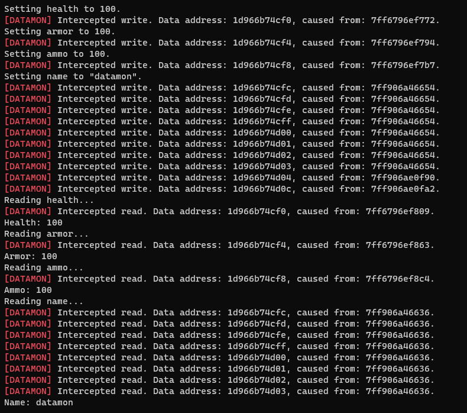

# Datamon

Datamon is a Windows-only library for monitoring access to data in a process. It does this by setting PAGE_GUARD on the memory pages that contain the data. This causes an exception to be raised when the data is accessed, which datamon catches and reports to the user.

## Vectored Exception Handling

Datamon catches the exception by using the Vectored Exception Handling (VEH) mechanism. In the exception handler, datamon checks if the exception was caused by an access to data that is being monitored. If it is, datamon calls the user's callback function.

## Augmented AVL Interval Tree

Datamon uses an augmented interval tree on top of an AVL tree in order to store the intervals of which addresses are being monitored. This allows datamon to quickly and efficiently find which callbacks to call when an exception is caught. For this use case, an AVL tree is more suitable than for example a red-black tree because datamon is read-heavy since it needs to check if an address is being monitored every time an exception is caught.

## Usage

```cpp
// define a callback function
void callback(void* accessing_address, bool read, void *data) {
    std::cout << "callback!\n";
}

// initialize datamon to monitor some data
datamon::Datamon dm{ my_data, sizeof(*my_data), callback };

// access the data and datamon will catch the access for you
my_data->value = 123; // prints "callback!" to stdout
```

## Example

Check out [src/example](src/example) in order to see the full source code of the example below.

```cpp
  std::cout << "Setting health to 100.\n";

  player->health = 100;

  std::cout << "Setting armor to 100.\n";

  player->armor = 100;

  std::cout << "Setting ammo to 100.\n";

  player->ammo = 100;

  std::cout << "Setting name to \"datamon\".\n";

  strcpy_s(player->name, "datamon");

  std::cout << "Reading health...\n";
  int health = player->health;
  std::cout << "Health: " << health << "\n";

  std::cout << "Reading armor...\n";
  int armor = player->armor;
  std::cout << "Armor: " << armor << "\n";

  std::cout << "Reading ammo...\n";
  int ammo = player->ammo;
  std::cout << "Ammo: " << ammo << "\n";

  std::cout << "Reading name...\n";
  char name[32];
  strcpy_s(name, player->name);
  std::cout << "Name: " << name << "\n";
```

Running the example program will produce the following output. You can see the interception messages in between the messages from the program itself.


